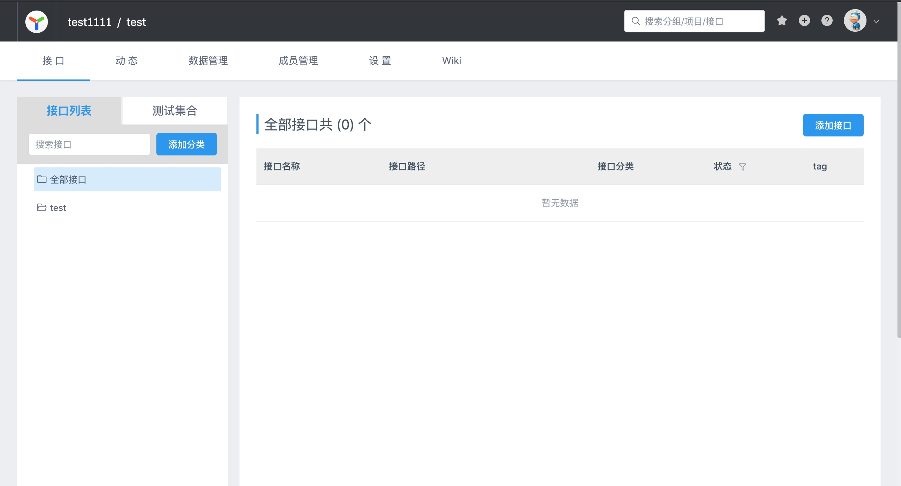
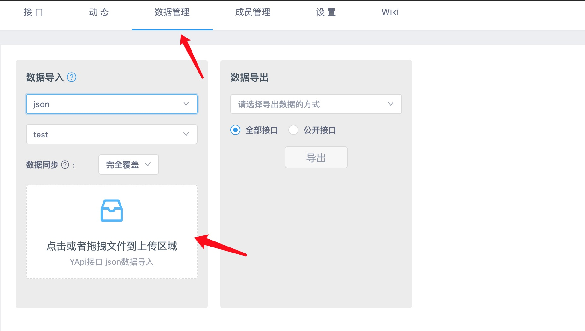

# 帮助文档

## 一、安装环境

1. 安装Node.js

windows

https://nodejs.org/zh-cn/

Centos

```bash
sudo yum install nodejs -y
```

Ubuntu

```bash
curl -sL https://deb.nodesource.com/setup_10.x -o /tmp/nodesource_setup.sh
sudo bash /tmp/nodesource_setup.sh
sudo apt install nodejs -y
```

更换npm源

```bash
# 设置npm源为淘宝镜像，加速安装
npm config set registry https://registry.npm.taobao.org
npm set sass_binary_site https://npm.taobao.org/mirrors/node-sass
```

2. 安装apidoc

```bash
npm install apidoc -g
```

## 二、生成apidoc文档

```bash
# apidoc -i 代码文件夹 -o 文档存放目录
apidoc -i ./code/ -o ./apidoc/
```

## 三、转换yapi支持的json文件

转为yapi格式的json文件(抛弃，yapi格式json文件不支持api请求导入)

```bash
# python3 apidoc2yapi.py -s apidoc生成的json文件 -d 转化后的json文件
# 该脚本可用于手动导入
python3 apidoc2yapi.py -s ./apidoc/api_data.json -d ./yapi_api_data.json
```

转为swagger格式的json文件(这种方式支持api导入)

```bash
# python3 apidoc2yapi.py -s apidoc生成的json文件 -d 转化后的json文件
# 该脚本可用于手动导入
python3 apidoc2swagger.py -s ./apidoc/api_data.json -d ./swagger.json
# 转为json schema格式的json文件，可用于请求参数检查，细节需要自行添加
python3 apidoc2swagger.py -s ./apidoc/api_data.json -d ./swagger.json -p
# python3 upload2yapi.py -s apidoc2swagger.py转换的json文件 -t 项目token -i yapi IP地址
# 通过api方式上传到yapi
python3 upload2yapi.py -s swagger.json -t <project token> -i <yapi ip address>
```


## 四、导入YAPI中

* 如果没有分类，新建分类



* 选择数据管理，数据导入，选择json类型，选择生成的yapi_api_data.json文件导入，选择完全覆盖，如果有相同的api，可能会被重叠掉，请注意。如果使用swagger的方式，在数据导入下选择swagger。


## 五、规范及示例

[代码示例](../example/)

[模板代码](../example/template.py)

### 1. @api

子模块名用英文，方便yapi排序（强制要求）

@api {请求方法} 请求路径 子模块名/api名称

```
@api {get} /api/example/:id sonExample/获取详情
@api {get} /api/example/:id loadbalancer/获取负载均衡详情
```

### 2. @apiName

apiName是方便apidoc解析，需要唯一

@apiName api名称

```
@apiName ShowExampleDetails
```

### 3. @apiGroup

apiGroup为一个模块的名称，下面所有的子模块及其api都需要统一项目名（强制要求）

@apiGroup 项目名

```
@apiGroup project
@apiGroup neutron
```

### 4. @apiDescription

apiDescription 简单的文字描述，一段话就可以，不用换行，换行会被apidoc处理掉

```
@apiDescription api简单描述
```

### 5. @apiHeader

@apiHeader 请求头

```
@apiHeader Content-Type=application/json
```

### 6. @apiParam

@apiParam (不写|Query|Path) {参数类型[=可选值]} 请求参数名称[=默认值] 请求参数说明，必选字段

@apiParam (不写|Query|Path) {参数类型[=可选值]} [请求参数名称[=默认值]] 请求参数说明，可选字段

如果换行不能解决长度超过79，在末尾添加`  # noqa`,#号前两个空格，#号后一个空格

注意： 换行参考example1.py[example1](../example/example1.py)

```python
"""
# body参数
@apiParam {String="A","B","C"} data.d.a="A" 对象d的a字段，默认值为A，可选为A,B,C
@apiParam {String{..10}} a 最大长度为10
@apiParam {String{1..10}} b 长度为1到10
@apiParam {Number{1-10}} c 大小范围1到10
@apiParam {String[]} e 数组类型
@apiParam {Object} f 对象类型
@apiParam {String} [f.a] f对象中的a字段，该字段可选
@apiParam {String=A,B,C,D,E} data.example1.example2.example3 如果参数过长可以换行
@apiParam
	{String=A,B,C,D,E} data.example1.example2.example3 如果参数过长可以换行
@apiParam {String=A,B,C,D,E} data.example1.example2.example3
	如果参数过长可以换行
@apiParam
	{String=A,B,C,D,E} data.example1.example2.example3
	如果参数过长可以换行
@apiParam {String=A,B,C,D,E} data.example1.example2.example3 如果换行不能解决参数过长  # noqa

# Query参数
# /api/example?id=uuid
@apiParam (Query) {String} id id

# Path参数
# /api/example/uuid
@api {get} /api/example/:id 获取详情
@apiParam (Path) {String} id id
"""
```

### 7. @apiParamExample

@apiParamExample {JSON} 请求示例

```
@apiParamExample {JSON} 请求示例
1. 说明写这里1，可以不写
2. 说明写这里2，可以不写
{}
```

### 8. @apiSuccess

@apiSuccess {参数类型[=可选值]} 请求参数名称[=默认值] 请求参数说明

如果换行不能解决长度超过79，在末尾添加`  # noqa`,#号前两个空格，#号后一个空格

```python
"""
@apiSuccess {String="A","B","C"} data.d.a="A" 对象d的a字段，默认值为A，可选为A,B,C
@apiSuccess {String{..10}} a 最大长度为10
@apiSuccess {String{1..10}} b 长度为1到10
@apiSuccess {Number{1-10}} c 大小范围1到10
@apiSuccess {String[]} e 数组类型
@apiSuccess {Object} f 对象类型
@apiSuccess {String} f.a f对象中的a字段

@apiSuccess {String=A,B,C,D,E} data.example1.example2.example3 如果参数过长可以换行
@apiSuccess
	{String=A,B,C,D,E} data.example1.example2.example3 如果参数过长可以换行
@apiSuccess {String=A,B,C,D,E} data.example1.example2.example3
	如果参数过长可以换行
@apiSuccess
	{String=A,B,C,D,E} data.example1.example2.example3
	如果参数过长可以换行
@apiSuccess {String=A,B,C,D,E} data.example1.example2.example3 如果换行不能解决参数过长  # noqa

"""
```

### 9. @apiSuccessExample

@apiSuccessExample {JSON} 响应示例

```
@apiSuccessExample {JSON} 响应示例
1. 说明写这里1，可以不写
2. 说明写这里2，可以不写
{}
```

## 六、python schema

转为python schema简约格式的json

```bash
# 可以将需要生成的python注释文件放入一个文件夹中，执行apidoc命令，不然生成结果可能会很多
apidoc -i khatch/khatch_api/api/lbaas -o apidoc
# python3 apidoc2swagger.py -s (apidoc转出的json文件) -p
python3 apidoc2swagger.py -s apidoc/api_data.json -p
```

复制对应请求url下，对应请求方法下，对应parameters下的请求参数，选择对应的schema进行修改即可。

注意：如果`"required": []`，则该字段需要删除

```json
{
  "/api/examples1": {
    "post": {
      "consumes": [
        "application/json"
      ],
      "description": "* 说明\n<p>api简单描述</p>\n\n<p>* 请求示例：<br>1.&nbsp;说明写这里1，可以不写<br>\n2.&nbsp;说明写这里2，可以不写<br>\n{<br>\n&nbsp;&nbsp;\"a\":&nbsp;\"\",<br>\n&nbsp;&nbsp;\"a1\":&nbsp;[],<br>\n&nbsp;&nbsp;\"b\":&nbsp;true,<br>\n&nbsp;&nbsp;\"c\":&nbsp;1,<br>\n&nbsp;&nbsp;\"d\":&nbsp;{<br>\n&nbsp;&nbsp;&nbsp;&nbsp;\"a\":&nbsp;\"A\",<br>\n&nbsp;&nbsp;&nbsp;&nbsp;\"b\":&nbsp;1<br>\n&nbsp;&nbsp;}<br>\n}</p>\n\n\n<p>* 返回示例：<br>1.&nbsp;说明写这里1，可以不写<br>\n2.&nbsp;说明写这里2，可以不写<br>\n{<br>\n&nbsp;&nbsp;\"id\":&nbsp;\"uuid\",<br>\n&nbsp;&nbsp;\"a\":&nbsp;\"\",<br>\n&nbsp;&nbsp;\"a1\":&nbsp;[],<br>\n&nbsp;&nbsp;\"b\":&nbsp;true,<br>\n&nbsp;&nbsp;\"c\":&nbsp;1,<br>\n&nbsp;&nbsp;\"d\":&nbsp;{<br>\n&nbsp;&nbsp;&nbsp;&nbsp;\"a\":&nbsp;\"A\",<br>\n&nbsp;&nbsp;&nbsp;&nbsp;\"b\":&nbsp;1<br>\n&nbsp;&nbsp;}<br>\n}</p>\n",
      "parameters": [
        {
          "in": "body",
          "name": "root",
          "schema": {
            "$schema": "http://json-schema.org/draft-04/schema#",
            "properties": {
              "a": {
                "type": "string"
              },
              "a1": {
                "items": {
                  "type": "string"
                },
                "type": "array"
              },
              "b": {
                "type": "boolean"
              },
              "c": {
                "type": "number"
              },
              "d": {
                "properties": {
                  "a": {
                    "enum": [
                      "A",
                      "B",
                      "C"
                    ],
                    "type": "string"
                  },
                  "aaaaaaaaaaaaaaaaaaaaaaaaaaaaaaaaaaaaa": {
                    "enum": [
                      "A",
                      "B",
                      "C"
                    ],
                    "type": "string"
                  },
                  "aaaaaaaaaaaaaaaaaaaaaaaaaaaaaaaaaaaaaaaaaaaaaa": {
                    "enum": [
                      "A",
                      "B",
                      "C"
                    ],
                    "type": "string"
                  },
                  "b": {
                    "enum": [
                      "A",
                      "B",
                      "C"
                    ],
                    "type": "string"
                  },
                  "c": {
                    "enum": [
                      "A",
                      "B",
                      "C"
                    ],
                    "type": "string"
                  }
                },
                "type": "object"
              }
            },
            "required": [
              "a",
              "a1",
              "b",
              "c",
              "d"
            ],
            "type": "object"
          }
        },
        {
          "default": "application/json",
          "description": "",
          "in": "header",
          "name": "Content-Type",
          "required": true,
          "type": "string"
        }
      ],
      "responses": {
        "200": {
          "description": "successful operation",
          "schema": {
            "$schema": "http://json-schema.org/draft-04/schema#",
            "properties": {
              "a": {
                "type": "string"
              },
              "a1": {
                "items": {
                  "type": "string"
                },
                "type": "array"
              },
              "b": {
                "type": "boolean"
              },
              "c": {
                "type": "number"
              },
              "d": {
                "properties": {
                  "a": {
                    "type": "string"
                  },
                  "b": {
                    "type": "number"
                  }
                },
                "required": [
                  "a",
                  "b"
                ],
                "type": "object"
              },
              "id": {
                "type": "string"
              }
            },
            "required": [
              "id",
              "a",
              "a1",
              "b",
              "c",
              "d"
            ],
            "type": "object"
          }
        }
      },
      "summary": "创建example1",
      "tags": [
        "example1"
      ]
    }
  }
}
```

